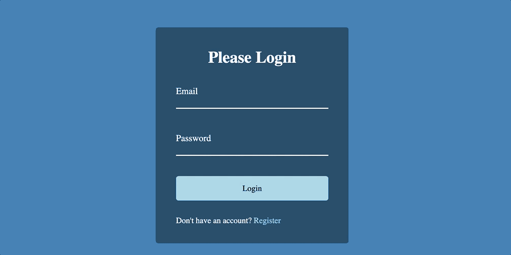

# 🌊 Form Wave Animation 🎛️

This is a captivating **Form Wave Animation** built with **HTML**, **CSS**, and **JavaScript**.  
It provides a wavy, animated background effect for forms, enhancing visual appeal and user engagement.

---

## 🎥 Demo

<p align="center">
  
</p>

---

## ✨ Features
-  Smooth wave animation in the form background  
-  Lightweight and visually pleasing design  
-  Enhances the UI with a subtle yet dynamic effect  

---

## 🛠️ Technologies Used
-  HTML  
-  CSS (majority — 53.8%)  
-  JavaScript (minor logic)  

---

## 🚀 How to Use
1. Clone the repository:
   ```bash
   git clone https://github.com/JehanAB/FormWaveAnimation.git
